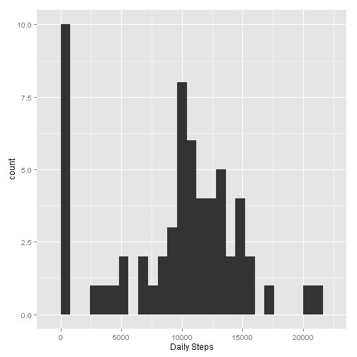
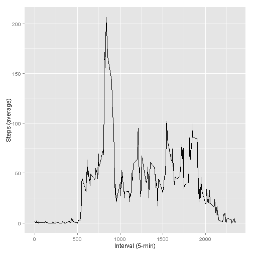
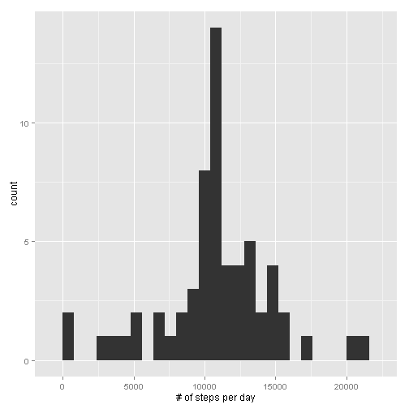

# Peer Assessment 1

The document is created to satisfy requirements for Peers Assessment 1, Reproducible Research class offered by Coursera. Today is Wed Jan 07 22:37:21 2015. 

### Loading and preprocessing the data

The code below downloads the data from the internet, unzips the file, and loads the content of the file in the variable. The script also converts the *date* filed to *Date*. The data is obtained from [Activity Monitoring Data](https://d396qusza40orc.cloudfront.net/repdata%2Fdata%2Factivity.zip).

#### Load the data

Unzipping the data file and loading the *activity.csv* file into the variable called *data*.  The variable is used to hold the content of the entire file, including NA entries.


```r
unzip("activity.zip")
data <- read.csv("activity.csv")
```

#### Process/transform the data (if necessary) into a format suitable for your analysis

The date field is converted to Date using *as.Date* function to assure that any date-related calculations will be executed properly.


```r
data$date <- as.Date(data$date)
```

### What is mean total number of steps taken per day?

The script below displays the histogram, mean, and median for the steps taken each day. *ggplot2* library is used to construct the histogram using *qplot* function. Disregard the warning recelived during the load of the *ggplot2* library. I am using R 3.1.1, but the *ggplot2* library is compiled using R 3.1.2. This should not make any difference.

#### Make a histogram of the total number of steps taken each day

The histogram is created using *qplot* function. *tapply* function was used to sum up the number of steps per day. Additiona, all the NA entries were removed when building *steps*.


```r
steps <- tapply(data$steps, data$date, FUN=sum, na.rm=TRUE)
library(ggplot2)
qplot(steps, binwidth=800, xlab="Daily Steps")
```

 

#### Calculate and report the mean and median total number of steps taken per day

Calling *mean* and *median* functions on the *steps* dataset to obtain corresponding mean and median as required by the assignment.


```r
mean(steps)
```

```
## [1] 9354
```

```r
median(steps)
```

```
## [1] 10395
```

### What is average daily activity patter?

#### Make a time series plot of the 5-minute interval (x-axis) and the average number of steps taken, averaged across all days (y-axis)

The *aggregate* function is used to derive average of the steps per 5 minute interval. *ggplot2* library is used to creage time series plot.


```r
avgs <- aggregate(x=list(steps=data$steps), by=list(interval=data$interval), 
        FUN=mean, na.rm=TRUE)

ggplot(avgs, aes(x=interval, y=steps)) + geom_line() + xlab("Interval (5-min)") + 
       ylab("Steps (average)") 
```

 

#### Which 5-minute interval, on average across all the days in the dataset, contains the maximum number of steps?

Displaying the interval that contains the most daily steps: the interval number, and the number of steps. We display the whole row anlog with the row number form the *avgs*.


```r
avgs[which.max(avgs$steps),]
```

```
##     interval steps
## 104      835 206.2
```

### Imputing missing values

#### Calculate and report the total number of missing values in the dataset (i.e. the total number of rows with NAs)

Using *is.na()* function allows to find out the nmber of records with missing values for steps.


```r
na.s = sum(is.na(data$steps))
na.s
```

```
## [1] 2304
```

#### Devise a strategy for filling in all of the missing values in the dataset. The strategy does not need to be sophisticated. For example, you could use the mean/median for that day, or the mean for that 5-minute interval, etc.

I am wrtinging called *impute* to impute missing values based on the 5 minute inteval. The *avgs* dataset is used to obtain the mean for a given inteval.  The function takes two parameters: steps and a time interval. If steps is not NA, use the value, otherwise, obtain correspoding mean for the interval from *avgs*.


```r
impute <- function(steps, interval) {
    value <- ""
    if (!is.na(steps))
        value <- c(steps)
    else
        value <- (avgs[avgs$interval==interval, "steps"])
    value
}
```
#### Create a new dataset that is equal to the original dataset but with the missing data filled in.

Creating the dataset called *data1* with imputed values for all the NA's.  The check is executed to assure that indeed, there are no NA's in the newly created dataset.


```r
data1 <- data
data1$steps <- mapply(impute, data1$steps, data1$interval)
data1$date <- as.Date(data1$date)

# Checking for is.na
sum(is.na(data1$steps))
```

```
## [1] 0
```

#### Make a histogram of the total number of steps taken each day and Calculate and report the mean and median total number of steps taken per day. 


```r
new.steps <- tapply(data1$steps, data1$date, FUN=sum)
qplot(new.steps, binwidth=800, xlab="# of steps per day")
```

 


```r
mean(new.steps)
```

```
## [1] 10766
```

```r
median(new.steps)
```

```
## [1] 10766
```

#### Do these values differ from the estimates from the first part of the assignment? 

The values for *mean* and *median* are higher than in the original computations. This is due, most likely, to the fact that all the NA's now have values, which are grater than zero.

#### What is the impact of imputing missing data on the estimates of the total daily number of steps?

The values for *mean* and *median* are higher than those executed on the *data* dataset that contains NA's.

### Are there any differences in activity patters between weekdays and weekends?
